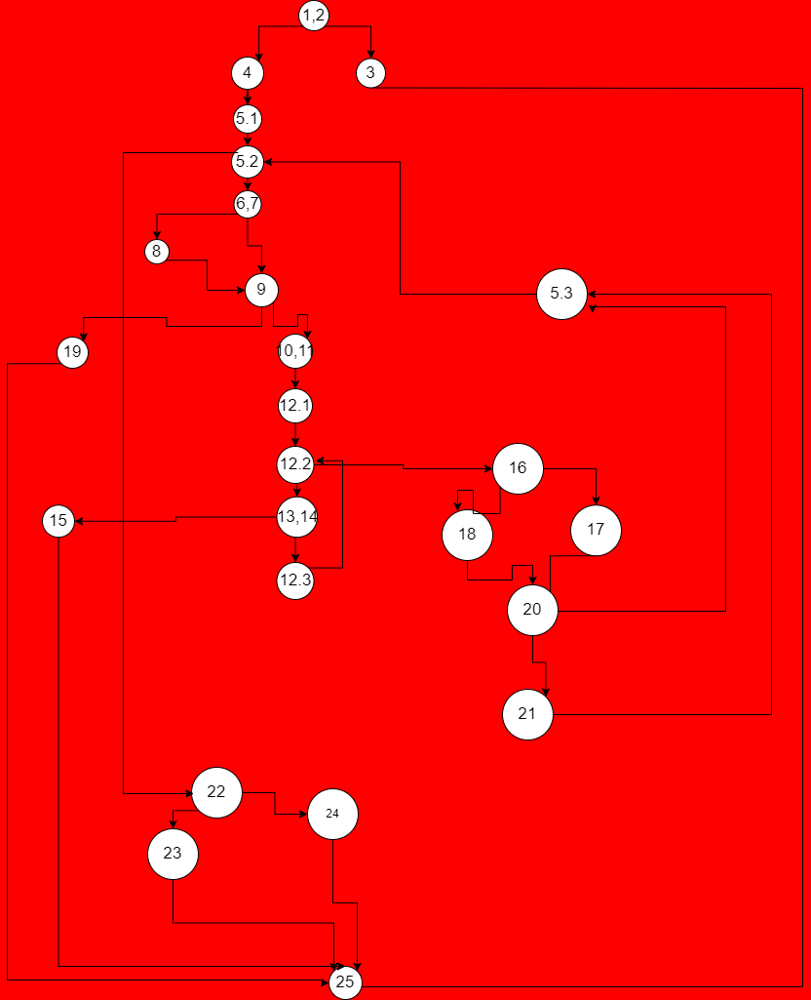

**Втора лабораториска вежба по Софтверско инженерство**

Дамјан Сандев, бр. на индекс 223245

**Control Flow Graph**

**Цикломатска комплексност**

Цикломатската комплексност може да се добие така што бројот на ребра и јазли се одземаат и се додава 2 или со броење на регионите. 
Резултатот е 10

**Every branch**

1. items=null payment=10 - 1,2->3->25, фрла Exception

2. items=["", "12", 180, 0.85f] payment=302  го сетира името на "unknown"

3. items=["Lab", "64A", 300, 0.84f] payment=200 фрла Exception за инвалид баркод 

4. items=["Lab", null , 300, 0.84f] payment=200 фрла Exception за null баркод

5. items=["Lab", "123", 402, 0f] payment=302 влегува во условот дали е dicount 0 и притоа исто врака false sum>payment 402>302

6. items=["Lab", "0555", 472, 0.82f] payment=360 влегува во условот каде
price > 300 discount > 0 i barcode[0]=0 исто така врака true 472*0.82-30=357 357 < payment 357 < 360

**Multiple Condition**

// if(item.getPrice() > 300 && item.getDiscount() > 0 && item.getBarcode().charAt(0) == '0')

        //TTT

        assertTrue(SILab2.checkCart(items(new Item("Lab","012",350,0.75f)),300));
        
        врака true бидејки 350*0.75-30<=300 т.е влегува во условот и цената на попуст се намалува за 30

        //TTF

        assertFalse(SILab2.checkCart(items(new Item("Lab","12",350,0.9f)),300));

        врака false бидејки цената на попуст 315 > 300, не се намалува за 30 значи и дека не влегува во условот

        //TFX

        assertFalse(SILab2.checkCart(items(new Item("Lab","012",350,0f)),349));

        врака false бидејки цената 350 > 349 попустот не е поголем од 0 значи не влегува во условот и цената не се намалува за 30
        
        //FXX

        assertFalse(SILab2.checkCart(items(new Item("Lab","012",250,0.65f)),150));

        врака false бидејки цената 250 > 150 не влегува во условот каде што би се намалила и би станала 132,5 

        X-означува било што

